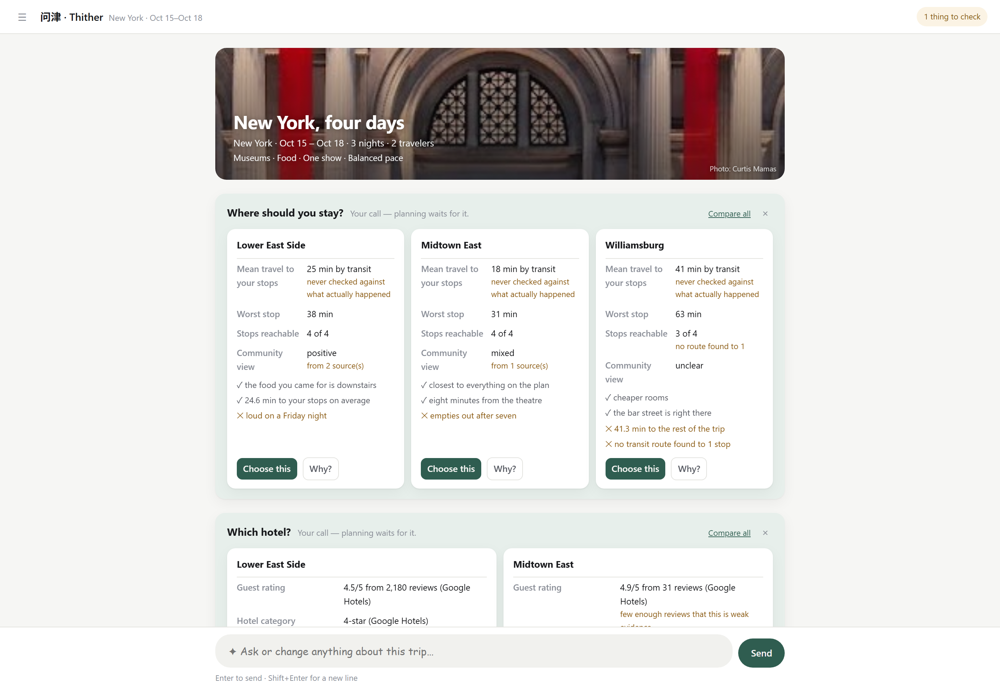
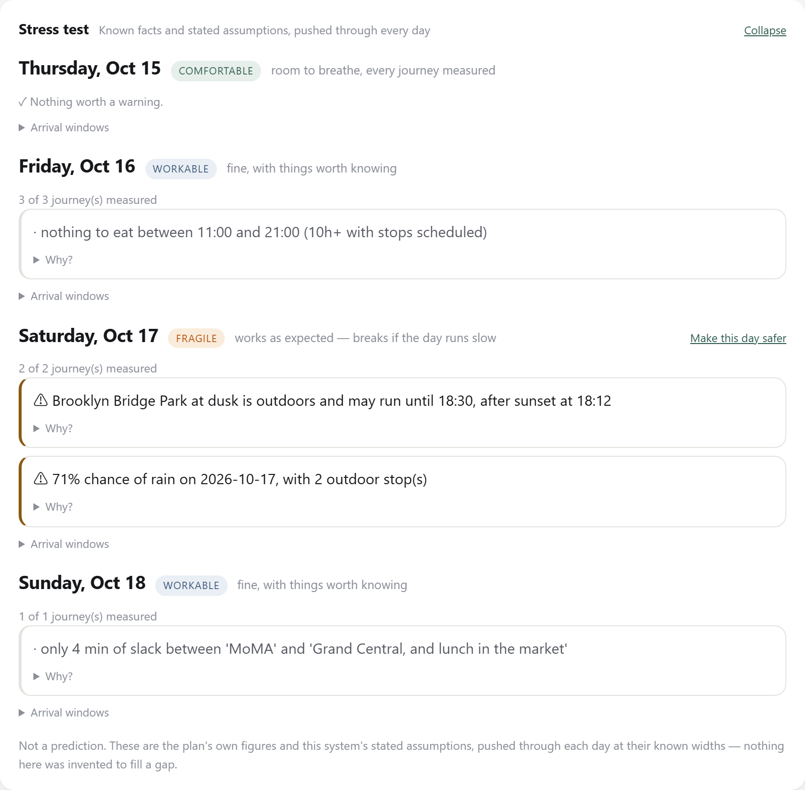

# 问津 · Thither

**一个对自己不知道什么保持诚实的旅行规划 agent。**

[](LICENSE)
[](pyproject.toml)
[](#测试)

*[English](README.md) · 中文*

它帮你决定去哪、用真实数字比较真实选项、排出地理和时间上都走得通的行程、解释它为什么这么推荐，
并且在你要求时**只重排某一天**。

它不订票、不碰支付，也不把 LLM 生成的事实当权威。

> *问津*，是在渡口问路 —— 陶渊明《桃花源记》末句 *后遂无问津者*，从此再没有人打听那个渡口。
> 英文名 *Thither* 是这句问话的另一半：**往那处去** —— 问，是为了得到这个答案。



---

## 凭什么不一样

多数旅行 agent 的失败方式是**自信地说错**。这个项目从结构上让它做不到，而且规则是写下来的、
不是指望的 —— 八条全在 **[INVARIANTS.md](INVARIANTS.md)**：

- **状态是真相，对话不是。** 模型的每一次改动都要走一条带修订号、锁强制和拒绝记忆的
  JSON-Pointer 补丁。LLM 只能提议，永远不能覆写。
  （[架构](docs/ARCHITECTURE.md#how-a-change-reaches-the-database)）
- **不知道 ≠ 否定。** "没人说过这家店有没有素食"和"这家店没有素食"是两个不同的事实，
  存储方式也不同。缺失的数字永远不会变成 0。
  （[不变量 1](INVARIANTS.md#1-absence-is-not-negation)）
- **分数不是置信度。** 每个排序在 `total` 旁边都带着 `coverage`，
  所以一个选项不可能靠"没人有它的数据"而胜出。
  （[不变量 2](INVARIANTS.md#2-a-score-is-not-a-confidence)）
- **它测量自己的误差。** 行程结束后，它把当初给你的数字和实际发生的对照，
  而"从没核对过"是**说出来**的，不是留白。
  （[不变量 7](INVARIANTS.md#7-a-figure-is-only-worth-something-if-something-could-contradict-it)）
- **引擎算数，模型解释。** 每一个到达窗口、每一个判定、每一个通勤时间都由确定性代码算出，
  模型被明令禁止在散文里重算一遍。
  （[不变量 8](INVARIANTS.md#8-the-engine-computes-the-model-explains)）

上面第四条，放在一个四天的行程上是这样的 —— 行程自己的数字，按各自已知的幅度推过每一天：



这个仓库里最值得读的大概是 **[docs/FIELD-NOTES.md](docs/FIELD-NOTES.md)** ——
那些只有把系统对着真实票价、真实路线、真实旅行者跑起来才会暴露的缺陷，
每一条都附着现在钉住它的那个测试。

---

## 60 秒看它跑起来 —— 不需要任何 API key

```bash
git clone https://github.com/wanghaoyu0408/travel-agent
cd travel-agent
python -m venv .venv && . .venv/bin/activate     # Windows: .venv\Scripts\activate
pip install -e ".[dev]"
```

三个 demo 完全自给自足 —— 不需要 key、不联网、不用起服务、结果确定：

```bash
python scripts/learn_from_trips.py       # 它会学，但只有你能决定是否采纳
python scripts/check_our_own_numbers.py  # 它测量自己通常错多少
python scripts/preview_the_trip.py       # 旅行预演，逐天压力测试
```

第四个走的是 HTTP 面 —— 锁、拒绝记忆、修订号、补丁引擎怎么拒绝一次改动 ——
需要另开一个终端把服务起来，但同样不需要 key：

```bash
python -m uvicorn app.main:app --reload   # 终端 1
python scripts/demo_milestone1.py         # 终端 2
```

`preview_the_trip.py` 会打印出这样的东西：

```
1. Safe as expected, fragile if the day runs slow
   2026-10-03 · FRAGILE   (1 of 1 journeys measured)
      Lunch reservation: planned 11:00 · expected 10:58 · conservative 10:58–11:02
         walking · 28 min · provider figure
      ⚠ late_arrival_risk: conservative arrival is 10:58–11:02

6. One road closure is not a finding
   a 14-minute estimate that took 95 minutes is a +579% error
   median before: +32.5%    after: +32.5%
```

完整脚本目录（含需要真实 provider 的那些）：**[docs/DEMOS.md](docs/DEMOS.md)**。

### 测试

```bash
python -m pytest -q
```

1049 个测试，不联网、不需要 key。`tests/scenarios/` 与每个里程碑的验收标准一一对应。

---

## 跑真的

把 `.env.example` 复制成 `.env`。`DATABASE_URL` 默认用 SQLite，所以唯一必须填的是
`GOOGLE_MAPS_API_KEY`。

这个 key 需要在 Google Cloud Console 里启用以下 API，且项目已开通计费：

| API | 用来做什么 | 没有它会怎样 |
|---|---|---|
| **Places API (New)** | 找地点。**旧版** Places API 不行 | 什么都跑不起来 |
| **Routes API** | 真实通勤时间 | 每一段路都报"未测量" |
| Weather API | 天气预报 | 季节性的那一半照常跑；Open-Meteo 不需要 key |
| Maps JavaScript API | 地图面板 | 面板会自己解释为什么是空的 |

可选，每个解锁一个功能、没有时诚实降级：`OPENAI_API_KEY`（对话本身）、
`DUFFEL_ACCESS_TOKEN`（航班搜索 —— 这份代码里根本没有出票路径）、
`SERPAPI_API_KEY`（酒店价格）。

```bash
python -m uvicorn app.main:app --reload
```

然后打开 **http://127.0.0.1:8000** 看 Web UI，或 `/docs` 看 API。

UI 是单个文件（`app/web/index.html`），不用 CDN、不烤任何 key 进去。
一个回合要几分钟，因为它真的在调 Google、Duffel、SerpApi 和一个 LLM，
所以界面上有计时器，并且实时显示它正在调用哪个工具。

> **`MAPS_BROWSER_API_KEY` 是可选的，但只要这个应用不止你一个人能访问就必须设。**
> 网页会公开它加载的任何 key，所以共用一个 key 等于把你的 Places 和 Routes 配额
> 连同地图一起发出去。见 [SECURITY.md](SECURITY.md)。

---

## 一次改动怎么进到数据库

```
用户消息
    -> 读出 TripState
    -> LLM 提出一个 TripPatch
    -> 修订号匹配                        否则 409
    -> 受保护路径拒绝
    -> 操作应用到副本上                  (RFC 6901 JSON Pointer)
    -> 整个状态重新校验                  -> schema 错误在这里暴露
    -> 锁强制                            否则 422 LOCK_VIOLATION
    -> 拒绝记忆强制                      否则 422 REJECTION_VIOLATION
    -> 硬约束检查                        否则 422 CONSTRAINT_VIOLATION
    -> 引用完整性检查                    否则 422 INTEGRITY_ERROR
    -> 修订号 += 1，落库，审计
```

任何一步失败都会中止整个补丁。**没有部分应用**，也没有任何路径能让调用方直接塞回一个替换状态。

---

## 想读更多

| 文档 | 它的职责 |
|---|---|
| **[INVARIANTS.md](INVARIANTS.md)** | 八条不许漂移的规则，每条附上理由、强制点和钉住它的测试 —— 外加一份 63 行的缺陷账本，全是跑出来才发现的 |
| **[docs/FIELD-NOTES.md](docs/FIELD-NOTES.md)** | 那本账本的长篇版：什么坏了、怎么发现的、改了什么 |
| **[docs/ARCHITECTURE.md](docs/ARCHITECTURE.md)** | 值得知道的设计决策、目录结构、API 面、存储 |
| **[docs/DEMOS.md](docs/DEMOS.md)** | 每个验收脚本证明什么、跑一次要花什么 |
| **[CONTRIBUTING.md](CONTRIBUTING.md)** | 怎么跑检查，以及一次改动需要遵守的房规 |
| **[SECURITY.md](SECURITY.md)** | 它保护什么、不保护什么，以及怎么处理 key |

---

## 范围，以及它刻意**不是**什么

把这个说清楚，和项目其余部分是同一种纪律。

- **单用户，无鉴权。** 没有登录，也没有按用户隔离：任何能连到这个端口的人，
  都能看到并修改所有行程。它是个人工具。**不要暴露到公网** ——
  见 [SECURITY.md](SECURITY.md)。
- **单进程。** 每个行程的 agent 互斥锁、运行注册表和 HTTP 缓存都在内存里，
  所以起多个 worker 会静默破坏"一个行程同时只有一个回合"这个保证。
- **按回合设限，不按天。** 一个回合在轮数、token、付费接口调用数和单次回复长度
  四个维度上都有上限，撞上任何一个都会明说，不会静默截断。但**跨回合**没有任何总量控制 ——
  表在 [SECURITY.md](SECURITY.md#what-one-turn-can-spend)。
- **它不订票。** 没有出票、没有支付、没有预订。航班和酒店 provider 在结构上是只读的，
  并且有一个测试断言 Duffel 模块里不存在任何与订单、支付、选座、退改相关的命名。
- **它不把事实托付给模型。** 每个数字要么来自 provider，要么来自确定性代码。
  没有数字的时候，它会说没有。

里程碑 1–11 已完成；没有 8（它被并进了 7）。每个里程碑涵盖什么，见
[docs/ARCHITECTURE.md](docs/ARCHITECTURE.md)。

---

## 许可证

[Apache-2.0](LICENSE)。[NOTICE](NOTICE) 列出了它依赖但不再分发的第三方服务 ——
你要自备凭据，并受那些服务自己的条款约束。
